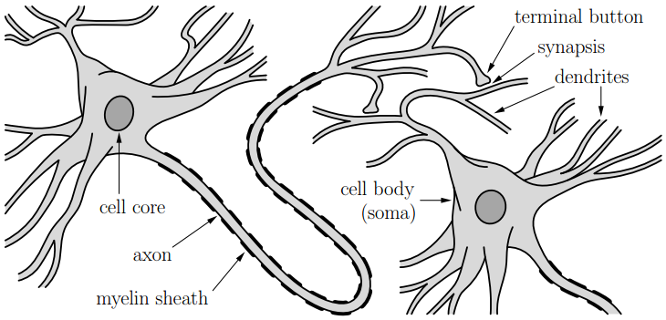
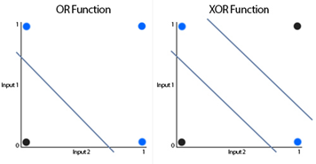

# Neural Networks and Backpropagation

---

# Agenda

* Neural networks
* Backpropagation
* Best practices
* Workshop

---

# NEURAL NETWORKS

---

# Introduction

* Classification
    * Pattern recognition (image, medical diagnosis, …)
    * Sequence recognition (printed text, handwriting, speech)
* Regression analysis (function approximation)
    * Time series prediction
* Other
    * Novelty detection (fraud detection)
    * Data compression (auto-encoders)
* Great investment in industry and academia

---

# History

* Inspired by human nervous system

---

# History

* 1960 - Perceptron
    * Limited to linearly separable problems
:::::: two_columns
::: first_column

:::
::: second_column

::::::

  * Insufficient compute power to perform training
* Stagnant until ~1980

---

# History

:::::: two_columns
::: first_column
* 1980-1995 – Multilayer perceptron
  * Universal approximator
  * Enough compute power

* 1995 - Stagnant again
  * More complex problems, lacks data and compute
  * Other techniques more popular (SVM)

* 2006 – Deep neural networks
  * Increase number of layers (higher abstraction level)
  * Large datasets GPU compute
* Very popular technique until today
:::
::: second_column

::::::
---
# Neural Network types

:::::: two_columns
::: first_column
* Feed forward
  * Fully connected

    

  * Convolutional
  
    
:::
::: second_column
* Recurrent

    
::::::
---