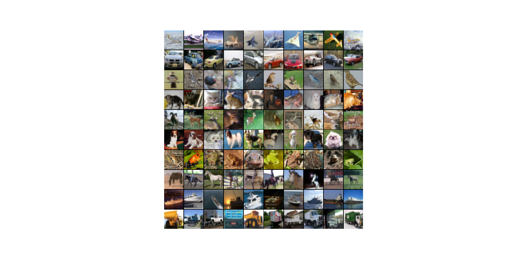
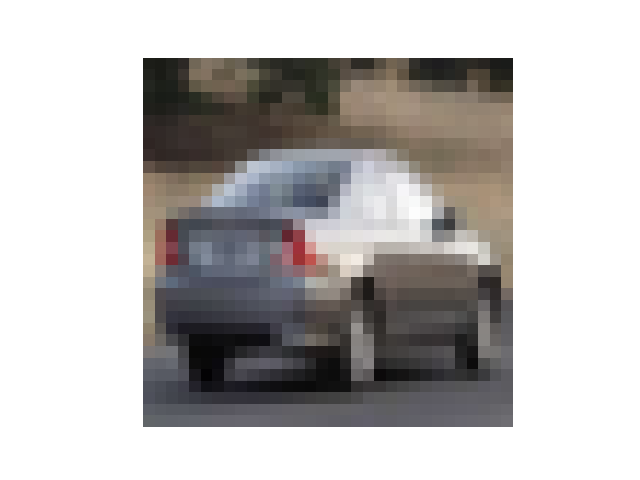
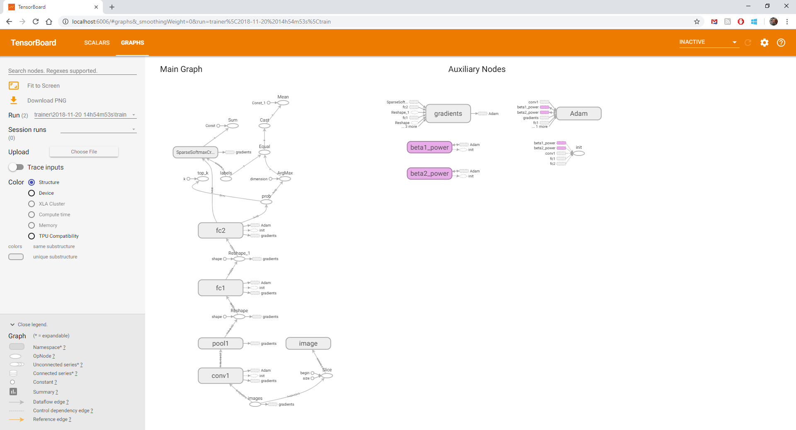
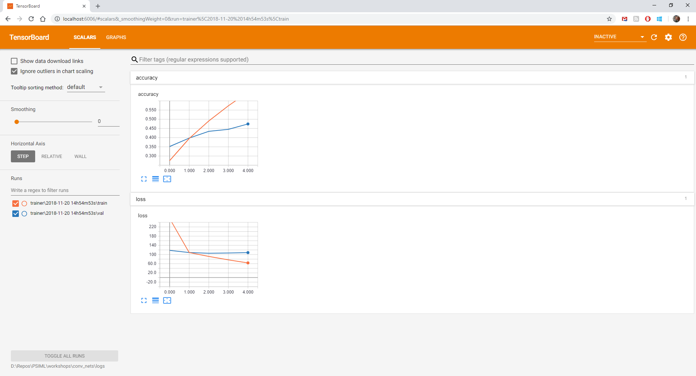
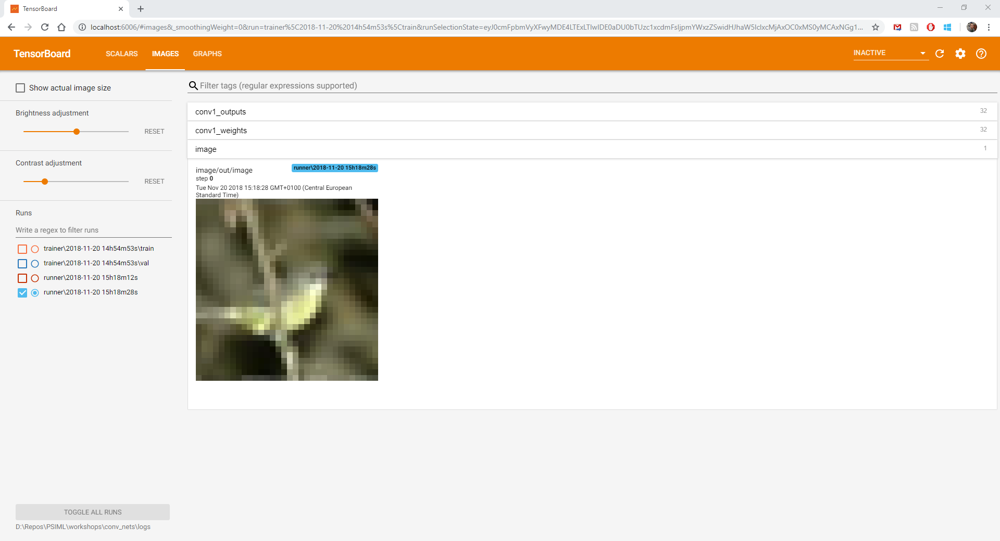
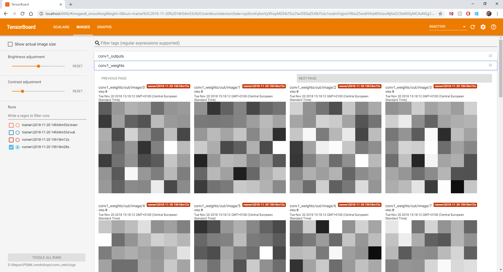
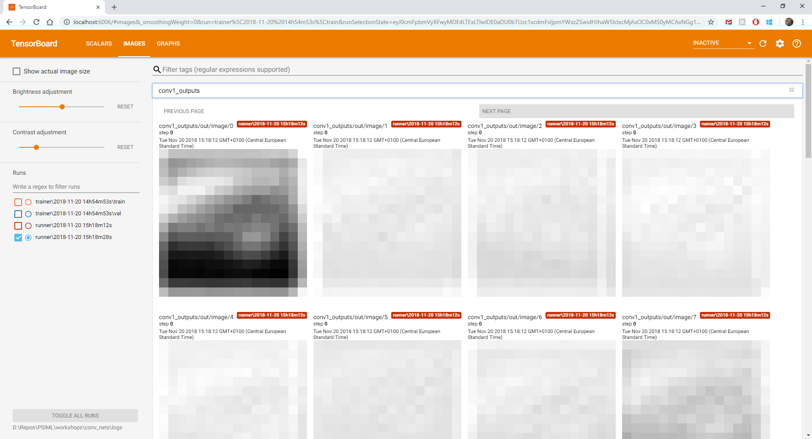
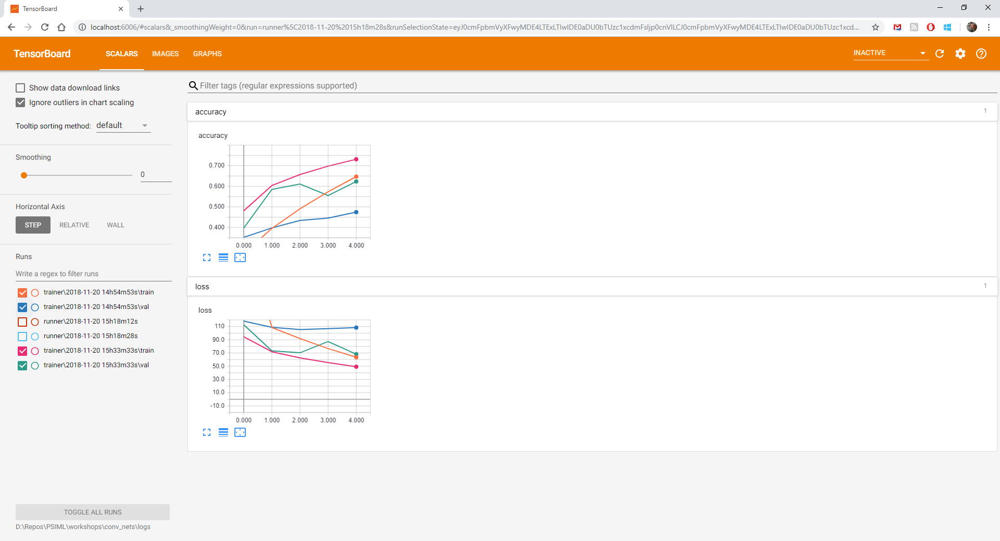

# Convolutional neural networks workshop

This folder contains a workshop that complements Convolutional neural networks lecture. The aim of this workshop is
to demonstrate basic usage of [TensorFlow library](https://www.tensorflow.org/) for convolutional neural networks
in Python. Specifically, you will build, train, and analyze a very simple convolutional neural network classifying
natural images into one of 10 classes.

TensorFlow is an open source system developed by Google for working with computation graphs. It supports
automatic differentiation, making it suitable for implementing backpropagation. Optimized implementation of
convolutional network is not trivial, especially on GPU. Therefore, in your projects you are much more likely
to use frameworks like TensorFlow than to code from scratch.

This workshop will cover the basics, providing references to additional resources where needed. You are welcome
to use many excellent tutorials on the web, including the
[one from Google](https://www.tensorflow.org/get_started/get_started).

The workshop is implemented in several Python files:
* `conv_nets.py` is the main script that you will not have to modify.
* `model.py` defines the `Model` class which encapsulates the network graph.
* `model_utils.py` defines utility functions for building the model, which are called from `model.py`.
* `runner.py` defines the `Runner` class which is used for getting network predictions on images.
* `trainer.py` defines the `Trainer` class which is used for training the network.
* `data_utils.py` defines utility functions for data loading and splitting that you will not have to modify.
* `vis_utils.py` defines utility functions for visualization that you will not have to modify.

General comments:
* Each task except the first one depends on completion of at least one of the preceding tasks.
* Some task may require you to implement many methods. However, implementations are very short -- up to
10 lines of code, usually far fewer.

Before you start it is important to examine project a bit. Navigate to conv_nets.py file to the main function at the bottom.
You will see how executing this file with certain number will do one of the following things:
 1. Prepare dataset, which makes sure all of the images are present on the machine and shows you how they look.
 2. Evaluate image, which runs random image from prepared dataset through the model, predicting and visualizing the class it belongs to.
 3. Evaluate dataset, which calculates loss and accuracy of the model (how well the model performs) on test set.
 4. 6. Train, which will train the model in order to improve its performance (calculated in step 3) and store trained weights on the disk.
 5. 7. Evaluate image, which is identical to the one in number 2, but is using trained model stored on the disk.

In simple words, the relation between `model.py`, `runner.py` and `trainer.py` files can be seen as following:
`model.py` contains the definition of the network, and its nodes.
`runner.py` is used to produce prediction on a single image, based on the given model (defined in `model.py`).
`trainer.py` is used for training and evaluating given model on batch of images.

## Tasks

1) **Download and verify dataset**

In the first task you don't have to do anything except run
```
python conv_nets.py 1
```
to download CIFAR-10 dataset for image classification that will be used throughout this workshop.
The script will also verify that the dataset is correctly set up by printing some data about it on
the console, and displaying a few random examples for each of the 10 classes.

```
----------------------------------------------------------------------
Loaded CIFAR-10.
----------------------------------------------------------------------
Dev data shape: (50000, 32, 32, 3).
Dev labels shape: (50000,).
Test data shape: (10000, 32, 32, 3).
Test labels shape: (10000,).
Class labels: [0 1 2 3 4 5 6 7 8 9].
Class names: ['airplane', 'automobile', 'bird', 'cat', 'deer', 'dog', 'frog', 'horse', 'ship', 'truck'].
```


More details about the dataset can be found [here](https://www.cs.toronto.edu/~kriz/cifar.html).

2) **Build and run a simple network**

In this task you will build definition of a simple convolutional network that showcases basic layer types.
You will then run the network on a single randomly chosen CIFAR-10 image.

You will use [tf.layers API](https://www.tensorflow.org/api_docs/python/tf/layers) in which a layers is
created by calling a single TensorFlow function. Note that *creating* a layer does *not* run any computation
for that layer, it only defines dimensions (input size, kernel size etc.). Computation takes place only
after the whole network is created (more on that below).

TensorFlow provides other high-level APIs, such as
[TensorFlow-Slim](https://github.com/tensorflow/tensorflow/tree/master/tensorflow/contrib/slim), which
has a large number of [pretrained models](https://github.com/tensorflow/models/tree/master/research/slim).
TF-Slim models can be combined `tf.layers`.

It may be helpful to inspect the already implemented `Model.add_classifier_net` method in `model.py` to
see how following layers connect with each other to form a network. Note that this function is called from 
`Model.__init__` method in `model.py` which is called from `conv_nets.evaluate_image` method in `conv_nets.py`.

In `model_utils.py` implement the following functions
* `image_placeholder`, which creates a *placeholder* for image data, which will be bound to actual data
later, when evaluating the network.
* `conv_layer`, which creates a convolutional layer.
* `pool_layer`, which creates a pooling layer.
* `fc_layer`, which creates a fully connected layer.

It may be helpful to inspect the already implemented `Runner.run` and `Runner.__init__` methods to see how
to instantiate `tf.Session`, and how the above three functions are combined when evaluating a network. 
Note that these function are called from `conv_nets.evaluate_image` method in `conv_nets.py`.

A network is executed by creating a `tf.Session` object and calling its
[`run` method](https://www.tensorflow.org/api_docs/python/tf/Session#run).
A session object encapsulates the control and state of the TensorFlow runtime.
The `run` method requires a set of outputs to be computed, and a mapping of input placeholders to actual data items.

In `runner.py` implement the following methods in `Runner` class:
* `get_fetches`, which defines which network nodes (outputs) should be evaluated.
* `get_feed_dict`, which defines how input placeholders map to actual input data.
* `get_predictions`, which post-processes the output (as described in documentation for that function).

To test correctness run
```
python conv_nets.py 2
```
which should display a randomly chosen image, and network predictions for it.
Since the network is untrained, the predictions are not expected to be correct.
```
----------------------------------------------------------------------
Running model.
----------------------------------------------------------------------
Ground truth: automobile.
Predictions:
Class "deer" with probability 100%.
Class "truck" with probability 0%.
Class "airplane" with probability 0%.
```


3) **Evaluate untrained network on test set**

The goal of this task is to implement additional operations for computing loss and accuracy, and
test it by evaluating loss and accuracy on CIFAR-10 test set. Since the network is still not
trained we expect accuracy to be low (similar to random guessing).

It may be helpful to inspect the already implemented `Model.add_loss_and_accuracy` method in `model.py` to see
how these new subnetworks attach to the network built earlier. Note that this function is called from 
`Model.__init__` method in `model.py` which is called from `conv_nets.evaluate_dataset` method in `conv_nets.py`.

In `model_utils.py` implement the following functions:
* `label_placeholder`, which creates a placeholder for human-annotated ground truth image label.
* `cross_entropy_loss`, which creates a subnetwork for computing cross-entropy loss function.
* `classification_accuracy`, which creates a subnetwork for computing classification accuracy.

In `trainer.py` implement the following methods in the `Trainer` class:
* `get_fetches`, which defines which network nodes should be evaluated.
* `get_feed_dict`, which defines how input placeholders map to actual input data.
* `get_loss_and_accuracy`, which extracts loss and accuracy values from full network output.
The last three methods should be analogous to those in the `Runner` class.

To test your implementation run
```
python conv_nets.py 3
```
which should produce output similar to:
```
----------------------------------------------------------------------
Evaluating model.
----------------------------------------------------------------------
Starting evaluation
Batch 0: loss = 3144.218, accuracy = 10.94%
Batch 100: loss = 3416.790, accuracy = 6.25%
End of evaluation: loss = 3176.916, accuracy = 11.76
```
Note that accuracy over the whole test set is close to random guessing (10%).
Different runs will produce different accuracies because weights are randomly initialized each time
(see `Trainer.__init__` in `trainer.py`).

4) **Train a model and save it to disk**

In this task you will train the network created earlier. To that end, you have to add new operations for
computing weight updates.

In `trainer.py`, `Trainer` class:
* Implement the `adam_optimizer` method, which adds a subnetwork that computes and applies weight updates
for a training step.
* Modify existing implementation of the `get_fetches` method, to make sure that weight update operation is
actually run (only in training regime, of course).
* Implement the `save` method, which saves current model to file.

To test your implementation run
```
python conv_nets.py 4
```
which should produce output similar to:
```
----------------------------------------------------------------------
Training model.
----------------------------------------------------------------------
Starting training epoch 1
Batch 0: loss = 4367.946, accuracy = 12.50%
Batch 100: loss = 140.124, accuracy = 25.00%
Batch 200: loss = 137.359, accuracy = 28.12%
Batch 300: loss = 131.673, accuracy = 26.56%
Batch 400: loss = 123.999, accuracy = 32.81%
Batch 500: loss = 106.684, accuracy = 45.31%
Batch 600: loss = 116.144, accuracy = 26.56%
Batch 700: loss = 119.744, accuracy = 37.50%
End of training epoch 1: loss = 296.120, accuracy = 29.30%
Starting validation after epoch 1
Batch 0: loss = 113.217, accuracy = 51.56%
End of validation after epoch 1: loss = 114.938, accuracy = 36.16%
Starting training epoch 2
Batch 0: loss = 102.923, accuracy = 40.62%
Batch 100: loss = 104.298, accuracy = 45.31%
Batch 200: loss = 98.785, accuracy = 37.50%
Batch 300: loss = 109.144, accuracy = 43.75%
Batch 400: loss = 103.753, accuracy = 35.94%
Batch 500: loss = 112.288, accuracy = 39.06%
Batch 600: loss = 103.937, accuracy = 42.19%
Batch 700: loss = 93.450, accuracy = 57.81%
End of training epoch 2: loss = 103.416, accuracy = 42.13%
Starting validation after epoch 2
Batch 0: loss = 98.479, accuracy = 35.94%
End of validation after epoch 2: loss = 106.441, accuracy = 41.96%
Starting training epoch 3
Batch 0: loss = 79.026, accuracy = 54.69%
Batch 100: loss = 97.137, accuracy = 45.31%
Batch 200: loss = 86.818, accuracy = 48.44%
Batch 300: loss = 87.569, accuracy = 53.12%
Batch 400: loss = 92.912, accuracy = 42.19%
Batch 500: loss = 83.672, accuracy = 57.81%
Batch 600: loss = 98.427, accuracy = 50.00%
Batch 700: loss = 97.252, accuracy = 50.00%
End of training epoch 3: loss = 88.937, accuracy = 50.27%
Starting validation after epoch 3
Batch 0: loss = 91.716, accuracy = 42.19%
End of validation after epoch 3: loss = 104.838, accuracy = 43.76%
Starting training epoch 4
Batch 0: loss = 74.077, accuracy = 56.25%
Batch 100: loss = 57.218, accuracy = 70.31%
Batch 200: loss = 58.630, accuracy = 64.06%
Batch 300: loss = 70.765, accuracy = 54.69%
Batch 400: loss = 79.780, accuracy = 51.56%
Batch 500: loss = 84.849, accuracy = 51.56%
Batch 600: loss = 110.312, accuracy = 42.19%
Batch 700: loss = 60.277, accuracy = 59.38%
End of training epoch 4: loss = 75.972, accuracy = 57.90%
Starting validation after epoch 4
Batch 0: loss = 101.607, accuracy = 56.25%
End of validation after epoch 4: loss = 105.326, accuracy = 45.78%
Starting training epoch 5
Batch 0: loss = 59.607, accuracy = 62.50%
Batch 100: loss = 54.846, accuracy = 73.44%
Batch 200: loss = 72.578, accuracy = 62.50%
Batch 300: loss = 41.926, accuracy = 84.38%
Batch 400: loss = 66.172, accuracy = 65.62%
Batch 500: loss = 87.558, accuracy = 51.56%
Batch 600: loss = 69.094, accuracy = 60.94%
Batch 700: loss = 66.134, accuracy = 60.94%
End of training epoch 5: loss = 63.585, accuracy = 65.08%
Starting validation after epoch 5
Batch 0: loss = 75.093, accuracy = 56.25%
End of validation after epoch 5: loss = 108.634, accuracy = 47.42%
----------------------------------------------------------------------
Evaluating model.
----------------------------------------------------------------------
Starting evaluation
Batch 0: loss = 107.148, accuracy = 50.00%
Batch 100: loss = 112.134, accuracy = 46.88%
End of evaluation: loss = 107.564, accuracy = 46.67%
```
When the training is done, there should be a set of checkpoint files in
`<repo_root>\workshops\conv_nets\checkpoints`.

5) **Load trained model from disk and examine its predictions**

In `runner.py` implement `Runner.load` method which loads weights from file.

To test your implementation run
```
python conv_nets.py 5
```
which should display a randomly chosen image, and network predictions for it, like in task 2.
Since the network is trained, the predictions should be significantly better than in task 2.
```
----------------------------------------------------------------------
Running model.
----------------------------------------------------------------------
Ground truth: airplane.
Predictions:
Class "airplane" with probability 63%.
Class "bird" with probability 22%.
Class "dog" with probability 5%.
```


Note:
Here you are loading only the weights into an existing graph.
For load to succeed, the graph needs to be the same as the one that produced the checkpoint file.
There is a way to load the graph definition from checkpoint as well, which is not covered here.
For more information on that, see
[Saving and Restoring Variables](https://www.tensorflow.org/api_guides/python/state_ops#Saving_and_Restoring_Variables),
[tf.train.Saver class](https://www.tensorflow.org/api_docs/python/tf/train/Saver), and
[tf.train.import_meta_graph function](https://www.tensorflow.org/api_docs/python/tf/train/import_meta_graph)
from official documentation, as well as this
[unofficial tutorial](http://cv-tricks.com/tensorflow-tutorial/save-restore-tensorflow-models-quick-complete-tutorial/).

6) **Visualize graph and training curves in TensorBoard**

In this task you will use [TensorBoard](https://www.tensorflow.org/guide/summaries_and_tensorboard) to visualize
data from your training. That includes the model graph, as well as how loss and accuracy change over time during
training.

TensorBoard is TensorFlow's visualization toolkit. It reads log files (also called event files) generated
by TensorFlow. Content is written to log files in the form of a *summary*, which is a wrapper around
[protocol buffers](https://developers.google.com/protocol-buffers/), a format for serializing structured data.
TensorFlow provides functions for creating summaries from Python and TensorFlow data types.

In this task you will be creating summaries from *Python* data types, because the values of interest
(loss and accuracy) exist in the form of Python variables, as you implemented it earlier. In the next task
you will see how to compute summaries in TensorFlow network directly.

In `trainer.py`, implement the following methods in `Trainer` class:
* `create_tensorboard_log`, which creates a new TensorBoard log file.
* `get_summary`, which creates a summary containing loss and accuracy data.
* `log_to_tensorboard`, which writes the summary to file log.

To test your implementation run
```
python conv_nets.py 6
```
which should run the same training as in task 4, but this time it will produce TensorBoard log files
under `<repo_root>\workshops\conv_nets\logs\trainer`. It will also produce new checkpoint files under
`<repo_root>\workshops\conv_nets\checkpoints`. These will be different from previous ones because
the repeated training has different random initialization.

Start TensorBoard and see the results:
* Activate your Python environment.
* Run `tensorboard --logdir=<repo_root>\workshops\conv_nets\logs` from console.
* Point your browser to the URL that TensorBoard outputs to console. You should be able to see the graph under
"graphs" tab, and loss and accuracy curves under "scalars" tab.




For more details on graph visualization see [official tutorial](https://www.tensorflow.org/get_started/graph_viz).
Note: graph visualization seems to work best in Google Chrome.

7) **Visualize weights and activations in TensorBoard**

In this task you will use TensorBoard to visualize the weight, inputs, and outputs of the `conv1` convolutional layer
that you added in task 2. Since weights and activations only exist inside a TensorFlow session, and not as Python
variables, it is convenient to export TensorBoard summaries directly from TensorFlow network.

In `model_utils.py` implement the following functions:
* `get_conv_weights`, and `get_conv_outputs`, which return handles to weight and output tensors, respectively, of the
convolution operation for a given convolutional layer. This is because our implementation from task 2 only provides
a handle to the output *of the whole convolutional layer*, and here you need access to *"internal" tensors* of that
layer.
* `conv_weight_summary`, and `conv_output_summary`, which convert weight and output tensors, respectively, into a
batch of grayscale images, suitable for visualization using already implemented function `image_summary` function
in the same file.

In `runner.py`, `Runner` class:
* Modify the `get_fetches` method to also evaluate the summary containing TensorBoard data. That summary is added
to the network in `Model.add_summary` function in `model.py`. Feel free to inspect that function, which is already
implemented.
* Implement `create_tensorboard_log` and `log_to_tensorboard` methods, which are analogous to those in task 6.
As in task 2, it may be helpful to inspect the already implemented `Runner.run` function in `runner.py` to see how
network is evaluated using these methods.

To test your implementation run
```
python conv_nets.py 7
```
which should produce similar type of output as in task 5, but this time it will produce TensorBoard log files
under `<repo_root>\workshops\conv_nets\logs\runner`.





## Further work

8) **Add batch normalization**

You will repeat tasks 6 and 7, but with a slightly better model which includes a batch normalization layer.
The goal is to confirm that batch normalization speeds up convergence, i.e. achieves better accuracy for
the same training time.

In `model.py` edit `Model.add_classifier_net` method as follows:
* Remove ReLU activation from the `conv1` layer.
* Insert batch normalization layer called `bn1` after the `conv1` layer. Use 
* Insert ReLU layer after the `bn1` layer.
* Note that `bn1` requires one new boolean input that indicates if the network is in training
or evaluation regime. Add this new placeholder.

In addition, modify the `Trainer` class in `trainer.py`, and the `Runner` class in `runner.py` to account
for the new placeholder.

If everything is implemented correctly, running
```
python conv_net.py 6
```
should produce output similar to:
```
----------------------------------------------------------------------
Training model.
----------------------------------------------------------------------
Starting training epoch 1
Batch 0: loss = 168.501, accuracy = 10.94%
Batch 100: loss = 107.982, accuracy = 37.50%
Batch 200: loss = 105.832, accuracy = 43.75%
Batch 300: loss = 74.360, accuracy = 64.06%
Batch 400: loss = 78.215, accuracy = 50.00%
Batch 500: loss = 84.946, accuracy = 56.25%
Batch 600: loss = 71.801, accuracy = 57.81%
Batch 700: loss = 100.495, accuracy = 37.50%
End of training epoch 1: loss = 94.470, accuracy = 48.09%
Starting validation after epoch 1
Batch 0: loss = 146.380, accuracy = 25.00%
End of validation after epoch 1: loss = 112.666, accuracy = 39.70%
Starting training epoch 2
Batch 0: loss = 65.078, accuracy = 64.06%
Batch 100: loss = 86.061, accuracy = 53.12%
Batch 200: loss = 72.160, accuracy = 62.50%
Batch 300: loss = 85.284, accuracy = 51.56%
Batch 400: loss = 73.193, accuracy = 62.50%
Batch 500: loss = 67.455, accuracy = 60.94%
Batch 600: loss = 85.171, accuracy = 54.69%
Batch 700: loss = 63.976, accuracy = 71.88%
End of training epoch 2: loss = 71.842, accuracy = 60.38%
Starting validation after epoch 2
Batch 0: loss = 95.327, accuracy = 46.88%
End of validation after epoch 2: loss = 73.203, accuracy = 58.50%
Starting training epoch 3
Batch 0: loss = 55.163, accuracy = 70.31%
Batch 100: loss = 71.319, accuracy = 60.94%
Batch 200: loss = 60.098, accuracy = 68.75%
Batch 300: loss = 68.237, accuracy = 60.94%
Batch 400: loss = 69.967, accuracy = 64.06%
Batch 500: loss = 55.633, accuracy = 64.06%
Batch 600: loss = 68.770, accuracy = 65.62%
Batch 700: loss = 53.198, accuracy = 75.00%
End of training epoch 3: loss = 62.612, accuracy = 65.71%
Starting validation after epoch 3
Batch 0: loss = 79.994, accuracy = 51.56%
End of validation after epoch 3: loss = 70.366, accuracy = 61.08%
Starting training epoch 4
Batch 0: loss = 46.628, accuracy = 75.00%
Batch 100: loss = 55.954, accuracy = 67.19%
Batch 200: loss = 55.582, accuracy = 71.88%
Batch 300: loss = 45.126, accuracy = 78.12%
Batch 400: loss = 54.600, accuracy = 67.19%
Batch 500: loss = 35.726, accuracy = 79.69%
Batch 600: loss = 65.676, accuracy = 71.88%
Batch 700: loss = 65.625, accuracy = 59.38%
End of training epoch 4: loss = 55.521, accuracy = 69.79%
Starting validation after epoch 4
Batch 0: loss = 102.668, accuracy = 46.88%
End of validation after epoch 4: loss = 87.282, accuracy = 55.48%
Starting training epoch 5
Batch 0: loss = 53.822, accuracy = 73.44%
Batch 100: loss = 45.538, accuracy = 71.88%
Batch 200: loss = 42.918, accuracy = 75.00%
Batch 300: loss = 37.027, accuracy = 79.69%
Batch 400: loss = 48.538, accuracy = 75.00%
Batch 500: loss = 43.298, accuracy = 75.00%
Batch 600: loss = 66.646, accuracy = 68.75%
Batch 700: loss = 53.014, accuracy = 73.44%
End of training epoch 5: loss = 49.242, accuracy = 73.15%
Starting validation after epoch 5
Batch 0: loss = 68.310, accuracy = 59.38%
End of validation after epoch 5: loss = 68.250, accuracy = 62.34%
----------------------------------------------------------------------
Evaluating model.
----------------------------------------------------------------------
Starting evaluation
Batch 0: loss = 70.476, accuracy = 67.19%
Batch 100: loss = 49.919, accuracy = 65.62%
End of evaluation: loss = 67.374, accuracy = 63.22%
```
Clearly, the training progresses much faster compared to that in previous training tasks 4 and 6, which can also be
observed in TensorBoard visualization.


As before, you can run
```
python conv_nets.py 7
```
to verify that classification accuracy is better than in task 7.
